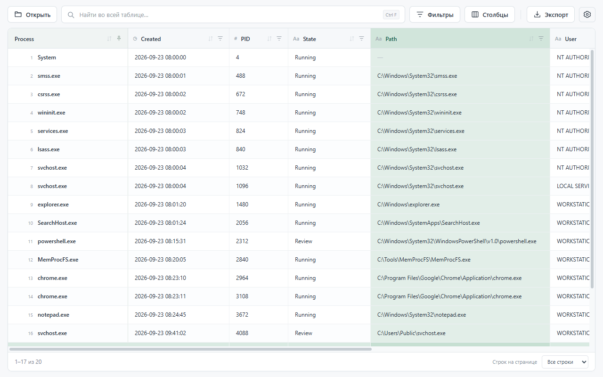
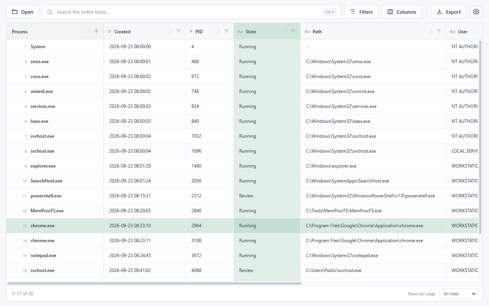

# Timeline

**Большие таблицы и журналы — в одном удобном окне.** 
**Large tables and logs, in one straightforward app.**

[**Скачать / Download**](https://github.com/Jumarf123/timeline/releases/latest/download/Timeline.exe) ·
[Все версии / Releases](https://github.com/Jumarf123/timeline/releases) ·
[Русский](#ru) · [English](#en)

## Русский

Timeline — бесплатный просмотрщик CSV, JSON и текстовых журналов для Windows. Открывайте файлы, которые много весят, находите записи, сортируйте и фильтруйте данные, затем можете сохранить результат в CSV.

### старт

1. [Скачайте Timeline.exe](https://github.com/Jumarf123/timeline/releases/latest/download/Timeline.exe).
2. Запустите приложение.
3. Нажмите **Открыть**, перетащите файл в окно или используйте **Ctrl+O**.
4. Введите запрос в поиск - то что вы хотите найти.

**Требования:** Windows 10/11 x64 и [Microsoft Edge WebView2 Runtime](https://developer.microsoft.com/microsoft-edge/webview2/#download-section). WebView2 обычно уже установлен. Для знакомства откройте [пример таблицы](samples/demo.csv).

### Возможности

| Задача | Что умеет Timeline |
|---|---|
| **Открыть большой файл** | Миллионы строк в одной прокручиваемой таблице. На экран выводится только нужная часть. Проверено на CSV объёмом 4 ГБ с 21 млн строк. |
| **Найти запись** | Поиск по всем строкам и столбцам, включая скрытые столбцы и полные значения длинных ячеек. Доступны регулярные выражения и учёт регистра. |
| **Отобрать нужное** | Несколько фильтров одновременно: содержит, равно, начинается с, пусто и другие. Фильтры работают вместе с поиском. |
| **Отсортировать** | Текст, числа, даты и Unix timestamps. Числа сравниваются численно, даты — по времени; «файл2» идёт перед «файл10». Тип можно выбрать в меню столбца. |
| **Настроить столбцы** | Перетаскивание за заголовок, изменение ширины, автоподбор по содержимому, скрытие столбцов и необязательное закрепление крайнего левого столбца. |
| **Выбрать удобный вид** | Все строки в одной таблице либо страницы по 100, 500, 1 000 или 5 000 строк. Обычная или компактная высота строк; масштаб от 50% до 200%. |
| **Посмотреть и сохранить** | Двойной щелчок открывает содержимое ячейки. Значение можно скопировать, а весь результат поиска и фильтрации — экспортировать в CSV. |

### Форматы и кодировки

- **CSV / TSV / PSV:** автоматический выбор разделителя, поля в кавычках и переносы строк внутри ячеек. Разделитель и наличие заголовков можно задать вручную.
- **JSON / JSONL / NDJSON:** массивы JSON и записи по одной на строку.
- **TXT / LOG:** текстовые журналы, одна строка — одна запись.
- **Кодировки:** UTF-8, UTF-16 LE/BE, Windows-1251 и Windows-1252. UTF-16 определяется по BOM; старые кодировки выбираются в параметрах открытия.

### Управление

| Действие | Как выполнить |
|---|---|
| Открыть файл / найти в таблице | **Ctrl+O / Ctrl+F** |
| Переместить столбец | Потянуть заголовок; зелёная линия показывает место вставки. У края включается прокрутка. **Escape** отменяет перенос. |
| Изменить ширину / вернуть автоподбор | Потянуть границу заголовка / дважды щёлкнуть по границе |
| Сортировать | Нажать заголовок: по возрастанию → по убыванию → исходный порядок |
| Перейти по ячейкам | **Стрелки**, **Page Up / Page Down** |
| Начало / конец результата | **Ctrl+Home / Ctrl+End** |
| Открыть / скопировать выбранную ячейку | **Enter / Ctrl+C** |
| Изменить / сбросить масштаб | **Ctrl+плюс / Ctrl+минус**, **Ctrl+колёсико / Ctrl+0** |

Горячие клавиши работают независимо от раскладки. Ручное изменение ширины доступно и при включённом автоподборе.

### Язык интерфейса

По умолчанию используется **регион Windows**: Россия, Беларусь и Украина — русский; остальные регионы — английский. Определение по IP не используется.

Сменить язык можно в **Настройки → Язык интерфейса**: «Автоматически», «Русский» или «English». Выбор сохраняется, применяется после нажатия «Сохранить» и не требует заново открывать файл. Исходные заголовки и значения не переводятся.

### Полезно знать

- Это просмотрщик: редактирование ячеек не предусмотрено.
- Даты вида **03/04/2026** означают **3 апреля**. Пустые значения при сортировке остаются в конце.
- В сетке показывается до 512 символов ячейки, в панели просмотра — до миллиона. Поиск и экспорт используют полные значения.
- Экспорт сохраняет **все найденные строки**, а не только текущую страницу, и все исходные столбцы в исходном порядке, даже скрытые.
- Порядок и ширина столбцов сохраняются при поиске и фильтрации до открытия другого файла. Общие настройки сохраняются между запусками.
- Скорость и объём памяти зависят от файла и компьютера. Сортировка большого файла требует больше памяти, чем обычный просмотр.

[Сообщить о проблеме](https://github.com/Jumarf123/timeline/issues) · [Сборка из исходников](docs/BUILD.md#ru)

---

## English

Timeline is a free local viewer for CSV, JSON and text logs on Windows. Open large files, find records, sort and filter data, and export the results to CSV.

**Your files are processed on your computer. Their contents are not uploaded, and source files remain unchanged.**

### Quick start

1. [Download Timeline.exe](https://github.com/Jumarf123/timeline/releases/latest/download/Timeline.exe).
2. Run it. No installation or administrator privileges are required.
3. Click **Open**, drop a file into the window, or press **Ctrl+O**.
4. Type in the search box. Search covers the entire file, including rows on other pages.

**Requirements:** Windows 10/11 x64 and [Microsoft Edge WebView2 Runtime](https://developer.microsoft.com/microsoft-edge/webview2/#download-section). WebView2 is usually already installed. Try the [sample table](samples/demo.csv) to explore the app.

### Features

| Task | What Timeline offers |
|---|---|
| **Open large files** | Millions of rows in one continuous table, with only the needed portion displayed. Tested with a 4 GB CSV containing 21 million rows. |
| **Find records** | Search every row and column, including hidden columns and complete long cell values. Supports regular expressions and case-sensitive search. |
| **Filter data** | Combine conditions such as contains, equals, starts with and is empty. Filters work together with search. |
| **Sort correctly** | Text, numbers, dates and Unix timestamps. Numbers sort numerically, dates chronologically, and “file2” comes before “file10”. Override the detected type in the column menu if needed. |
| **Arrange columns** | Drag headers to reorder, resize columns, fit them to contents, hide columns, or optionally pin the leftmost column. |
| **Adjust the view** | One continuous table or pages of 100, 500, 1,000 or 5,000 rows. Normal or compact row height; interface zoom from 50% to 200%. |
| **Inspect and export** | Double-click a cell to view and copy its contents. Export the complete search and filter result to CSV. |

### Formats and encodings

- **CSV / TSV / PSV:** delimiter detection, quoted fields and multiline cells. Choose the delimiter and whether the first row contains headers.
- **JSON / JSONL / NDJSON:** JSON arrays and one record per line.
- **TXT / LOG:** text logs, one record per line.
- **Encodings:** UTF-8, UTF-16 LE/BE, Windows-1251 and Windows-1252. UTF-16 is detected from its BOM; select legacy encodings in import settings.

### Controls

| Action | Control |
|---|---|
| Open a file / search | **Ctrl+O / Ctrl+F** |
| Move a column | Drag its header. A green line marks the destination; holding near an edge scrolls the table. **Escape** cancels. |
| Resize / restore automatic width | Drag the header boundary / double-click the boundary |
| Sort | Click a header: ascending → descending → original order |
| Navigate cells | **Arrow keys**, **Page Up / Page Down** |
| First / last record | **Ctrl+Home / Ctrl+End** |
| Open / copy the selected cell | **Enter / Ctrl+C** |
| Adjust / reset zoom | **Ctrl+plus / Ctrl+minus**, **Ctrl+mouse wheel / Ctrl+0** |

Shortcuts work across keyboard layouts. Manual resizing also works while automatic column fitting is enabled.

### Interface language

The default follows your **Windows region**: Russia, Belarus and Ukraine use Russian; all other regions use English. No IP lookup is used.

Go to **Settings → Interface language** to choose Automatic, Русский or English. Your choice is saved and takes effect when you click Save, without reopening the file. Imported headers and cell values are never translated.

### Before you start

- Timeline is a viewer; it does not edit cells.
- Dates such as **03/04/2026** mean **3 April**. Empty values remain at the end when sorting.
- The grid displays up to 512 characters per cell, and the cell viewer up to one million. Search and export use complete values.
- Export includes **all matching rows**, not just the current page, and all source columns in their original order, including hidden ones.
- Column order and widths remain in place through searches and filters until another file is opened. General settings persist across launches.
- Speed and memory use depend on your file and computer. Sorting large files uses more memory than browsing them.

[Report an issue](https://github.com/Jumarf123/timeline/issues) · [Build from source](docs/BUILD.md#en)
